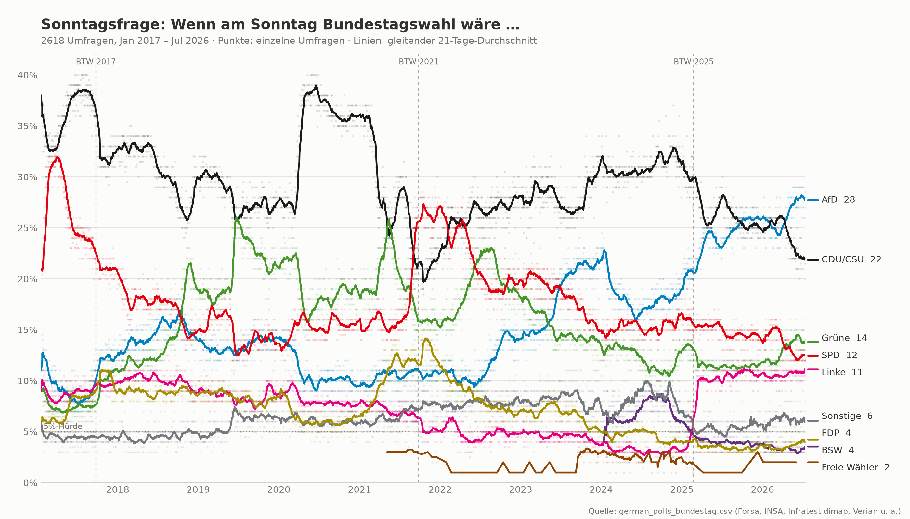
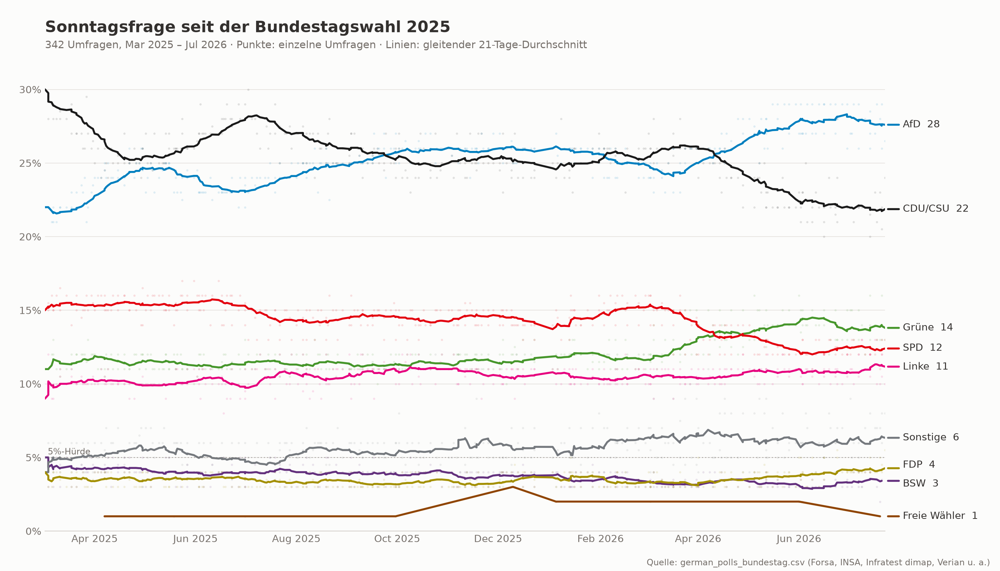
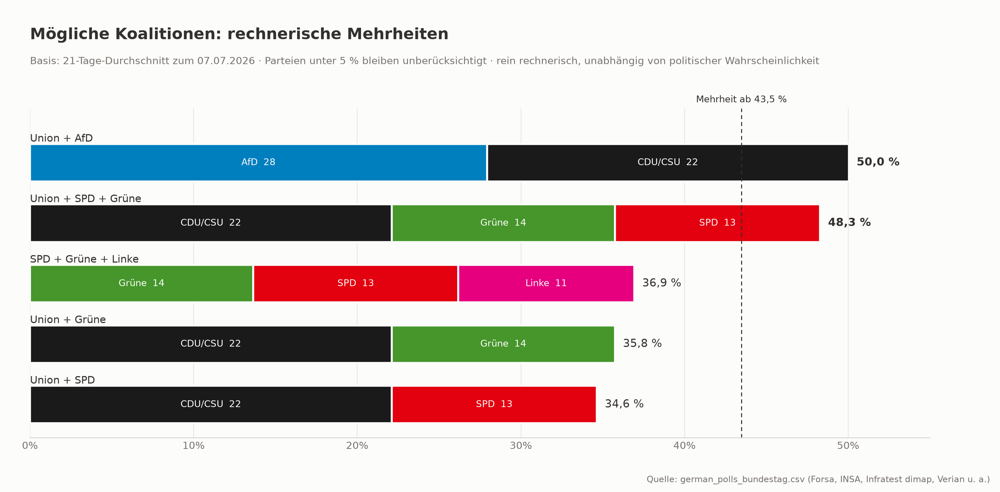
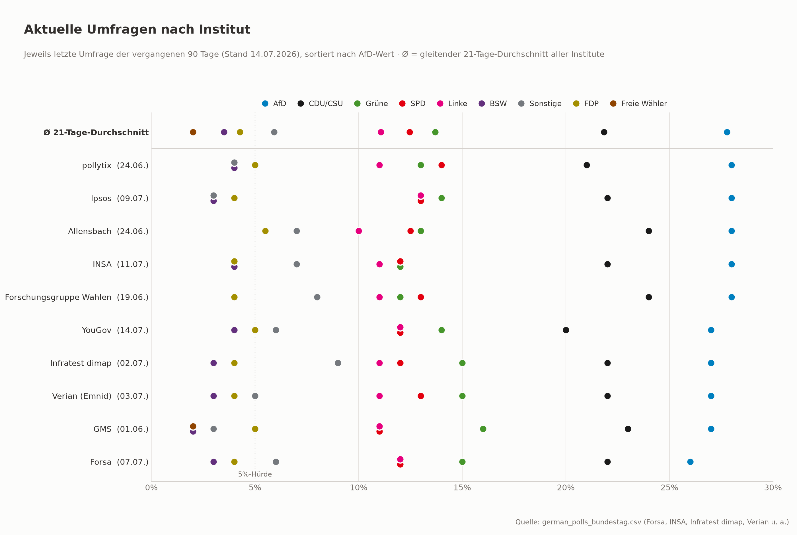
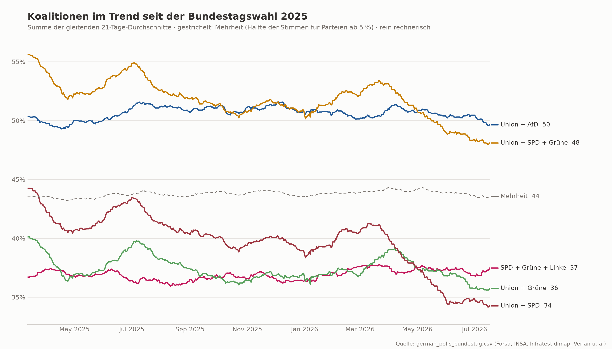
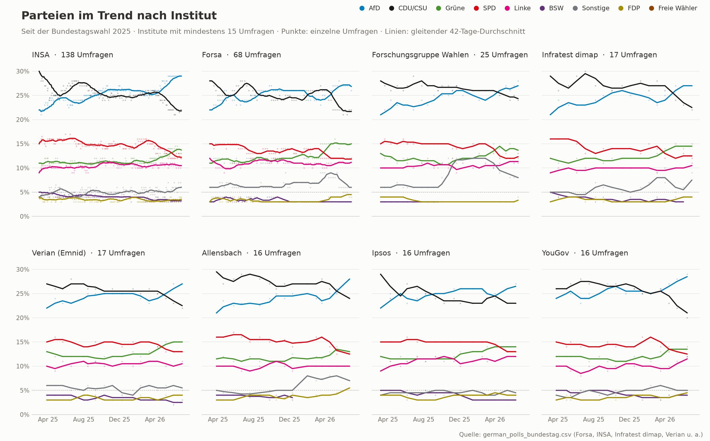

# GerElec — German Bundestag Polling Visualization

Visualizes German federal election ("Sonntagsfrage") polling data as a PNG chart:
every individual poll as a faint dot, with a 21-day rolling-average trend line per
party, from January 2017 through July 2026.



A second chart covers only the polls since the February 2025 federal election:



A third chart shows which coalition combinations would currently have a
parliamentary majority, based on the latest rolling averages (parties under
the 5% threshold excluded — purely arithmetic, regardless of political
plausibility):



A fourth chart compares institutes ("house effects"): each row is an
institute's most recent poll from the past 90 days, sorted by AfD share,
with the all-institute rolling average on top for reference:



A fifth chart tracks the coalition combinations over time since the 2025
election, as sums of the parties' 21-day rolling averages. The dashed line
is the majority threshold, computed per day as half the combined share of
parties at or above 5%:



A sixth chart breaks the party trends down by institute as small multiples —
one panel per institute with at least 15 polls since the 2025 election, all
on the same scale, with a wider 42-day rolling window since institutes poll
at very different rates:



## Usage

Requires [uv](https://docs.astral.sh/uv/) and Python ≥ 3.14. Dependencies
(pandas, matplotlib) are managed in `pyproject.toml`.

```sh
uv run main.py
```

This writes both PNGs. Options:

```sh
uv run main.py --csv path/to/polls.csv --out chart.png --out-recent recent.png
```

## Data

`german_polls_bundestag.csv` contains 2,610 polls with one row per poll:

| Column | Description |
|---|---|
| `date` | Publication date |
| `institute` | Polling institute (Forsa, INSA, Infratest dimap, Verian, …) |
| `tasker` | Commissioning outlet |
| `survey_start` / `survey_end` | Fieldwork period |
| `sample_size` | Respondents |
| `AfD` … `Freie Wähler` | Party vote shares in percent (blank where not reported) |

## Chart design

- **Dots** are individual polls (semi-transparent); **lines** are 21-day
  rolling averages, so sparse series (BSW from 2024, Freie Wähler) plot correctly.
- Vertical dashed lines mark the federal elections (BTW 2017, 2021, 2025);
  a dotted line marks the 5% electoral threshold (Fünf-Prozent-Hürde).
- Colors follow each party's conventional brand color, adjusted for contrast
  and colorblind separation (FDP gold vs. Freie Wähler orange, Linke magenta
  vs. BSW violet). Every line is directly labeled with its latest average,
  so no series is identified by color alone.
